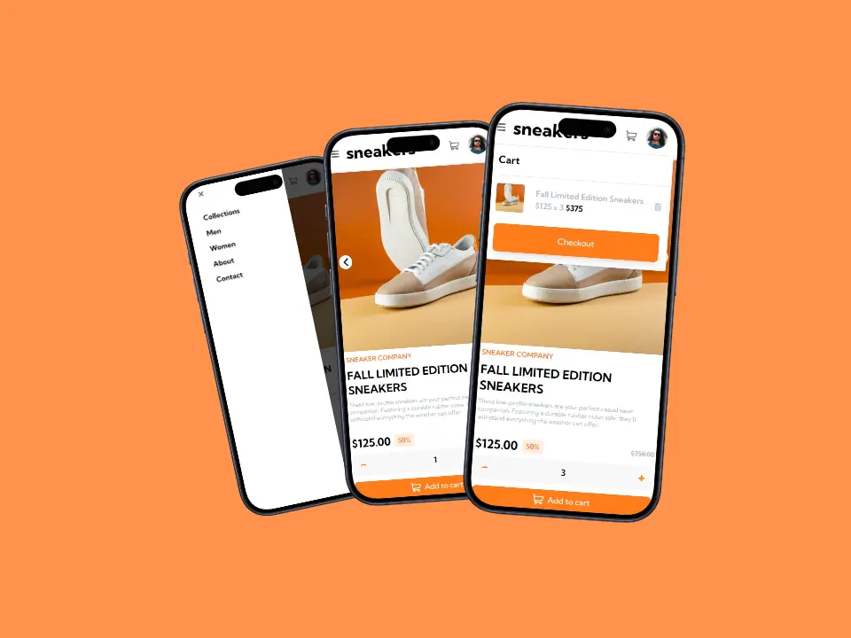
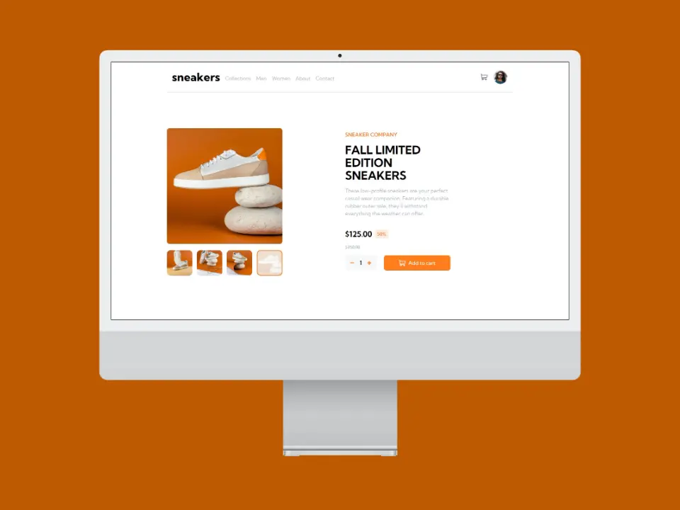

<!-- Improved compatibility of back to top link: See: https://github.com/othneildrew/Best-README-Template/pull/73 -->

# Frontend Mentor - E-commerce product page solution

This is a solution to the [E-commerce product page challenge on Frontend Mentor](https://www.frontendmentor.io/challenges/ecommerce-product-page-UPsZ9MJp6). Frontend Mentor challenges help you improve your coding skills by building realistic projects.

## Table of contents

- [Overview](#overview)
  - [The challenge](#the-challenge)
  - [Screenshot](#screenshot)
  - [Links](#links)
- [My process](#my-process)
  - [Built with](#built-with)  
- [Author](#author)
- [Acknowledgments](#acknowledgments)

## Overview

### The challenge

Users should be able to:

- [x] View the optimal layout for the site depending on their device's screen size
- [x] See hover states for all interactive elements on the page
- [x] Open a lightbox gallery by clicking on the large product image
- [x] Switch the large product image by clicking on the small thumbnail images
- [x] Add items to the cart
- [x] View the cart and remove items from it

### Screenshot

### Links

- Live Site URL: [netlify](https://main--zesty-biscotti-d4e006.netlify.app/)

## My process

### Built with

* [![Next][Astro]][[Next-url](https://astro.build/)]
* [![React][React.js]][[React-url](https://es.react.dev/)]

